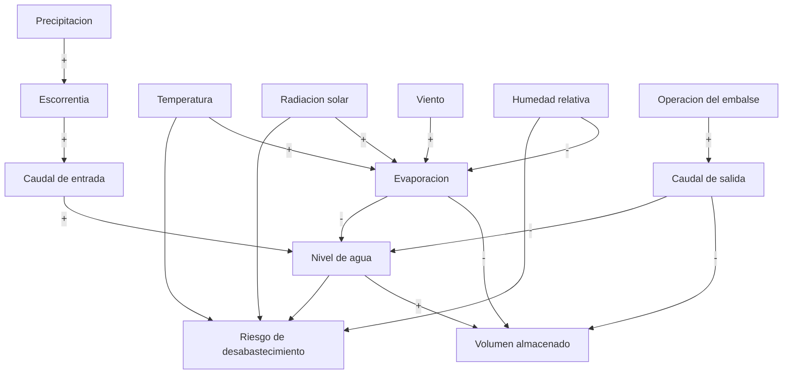

# Estudio del Embalse de Tomine para el sistema IoT

## 1. Objetivo del estudio

Este estudio identifica las variables hidrologicas, climaticas y operativas que afectan el nivel del Embalse de Tomine, con el fin de definir que debe medir el prototipo IoT y como debe interpretar las condiciones de posible escasez de agua.

El sistema no busca reemplazar una red hidrometeorologica institucional. Su objetivo es funcionar como un prototipo local de bajo costo que ayude a monitorear variables criticas y generar alertas in situ.

## 2. Ubicacion y lectura del mapa

El Embalse de Tomine se encuentra en Cundinamarca, al norte de Bogota, asociado principalmente a los municipios de Guatavita, Sesquile y Guasca. Hace parte de la cuenca alta del rio Bogota y de la subcuenca del rio Tomine.

Fuente de referencia para el mapa topografico:

- https://es-es.topographic-map.com/map-cr4dcz/Embalse-de-Tomin%C3%A9/

La lectura del mapa es importante porque permite entender tres aspectos:

1. El embalse recibe agua desde zonas mas altas de la cuenca.
2. La pendiente del terreno favorece la escorrentia hacia el cuerpo de agua cuando hay lluvia.
3. Las zonas cercanas al borde del embalse son puntos adecuados para ubicar sensores de nivel, siempre que el montaje sea seguro, estable y protegido.

Para el prototipo, el punto de medicion se puede representar como una estacion local ubicada cerca del borde del embalse o sobre una estructura fija. Desde alli se monitorea el nivel del agua y las condiciones ambientales del entorno.

## 3. Variables principales del embalse

| Variable | Tipo | Efecto sobre el embalse |
|---|---|---|
| Nivel de agua | Estado del embalse | Indica directamente si el embalse esta alto, medio o bajo. |
| Volumen almacenado | Estado del embalse | Representa la cantidad total de agua disponible. Depende del nivel. |
| Caudal de entrada | Entrada | Aumenta el nivel y el volumen almacenado. |
| Caudal de salida | Salida | Disminuye el nivel y el volumen almacenado. |
| Precipitacion | Climatica | Aumenta la escorrentia y puede elevar el caudal de entrada. |
| Evaporacion | Perdida natural | Reduce el volumen de agua, especialmente en periodos secos. |
| Temperatura | Climatica | A mayor temperatura, mayor tendencia a evaporacion. |
| Humedad relativa | Climatica | A menor humedad, mayor capacidad del aire para evaporar agua. |
| Radiacion solar | Climatica | Aporta energia para evaporacion. |
| Viento | Climatica | Favorece el intercambio de humedad entre el agua y la atmosfera. |
| Operacion del embalse | Humana/operativa | Las descargas o decisiones de manejo pueden cambiar el nivel. |

## 4. Mapa causal del sistema

El mapa causal muestra como una variable afecta a otra. El signo positivo indica que cuando una variable aumenta, la otra tiende a aumentar. El signo negativo indica que cuando una variable aumenta, la otra tiende a disminuir.



Interpretacion del mapa causal:

- Si aumenta la precipitacion, puede aumentar el caudal de entrada y subir el nivel.
- Si aumentan la temperatura, la radiacion solar o el viento, puede aumentar la evaporacion.
- Si baja la humedad relativa, el ambiente puede favorecer mas evaporacion.
- Si aumenta la salida de agua por operacion del embalse, disminuye el volumen almacenado.
- El riesgo de desabastecimiento aumenta cuando el nivel baja y al mismo tiempo hay condiciones secas o calidas.

## 5. Priorizacion de variables

Para el prototipo IoT no todas las variables tienen la misma importancia. Se priorizan las que aportan directamente a la deteccion temprana de escasez.

### Variables criticas

| Variable | Por que es critica | Sensor propuesto |
|---|---|---|
| Nivel de agua | Es la variable objetivo del sistema. Permite detectar bajo almacenamiento. | HC-SR04 o sensor de nivel/ultrasonico industrial. |
| Temperatura | Permite identificar condiciones de calor que favorecen evaporacion. | DHT22. |
| Humedad relativa | Permite identificar ambiente seco. | DHT22. |

### Variables importantes para mejorar el modelo

| Variable | Por que aporta | Sensor propuesto |
|---|---|---|
| Presion atmosferica | Ayuda a caracterizar cambios meteorologicos. | BMP280. |
| Radiacion solar | Se relaciona con evaporacion potencial. | LDR como aproximacion o sensor de radiacion. |
| Precipitacion | Explica posibles aumentos de nivel. | Pluviometro. |

### Variables secundarias o externas

| Variable | Razon |
|---|---|
| Caudal de entrada | Es muy util, pero requiere instalacion en rios o canales especificos. |
| Caudal de salida | Depende de la operacion del embalse y puede no estar disponible para un prototipo local. |
| Volumen almacenado | Se puede estimar a partir del nivel si existe una curva nivel-volumen. |
| Operacion del embalse | Es una variable humana/institucional, no siempre medible directamente con sensores del prototipo. |

## 6. Sensores IoT definidos para el prototipo

Para una primera version funcional del sistema se propone medir:

1. Nivel de agua con sensor ultrasonico HC-SR04.
2. Temperatura y humedad con sensor DHT22.
3. Presion atmosferica con BMP280, si se incluye en la version fisica.
4. Intensidad luminica como aproximacion a radiacion solar con LDR.
5. Alerta visual con LEDs verde, amarillo y rojo.
6. Alerta sonora con buzzer.
7. Visualizacion local con pantalla LCD 16x2.

La simulacion actual ya representa la parte principal del modelo:

- Nivel de agua con HC-SR04.
- Temperatura y humedad con DHT22.
- Estado del sistema en LCD.
- Alerta visual con LEDs.
- Alerta sonora con buzzer.

## 7. Modelo simplificado del comportamiento del embalse

El comportamiento general del embalse puede explicarse con un balance de agua:

```text
Agua almacenada futura = Agua almacenada actual + Entradas - Salidas - Perdidas
```

En forma simplificada:

```text
V(t+1) = V(t) + Qin + P - Qout - E
```

Donde:

- V(t) es el volumen almacenado actual.
- Qin es el caudal de entrada.
- P es el aporte por precipitacion.
- Qout es el caudal de salida.
- E es la perdida por evaporacion.

Para el prototipo IoT, como no se mide directamente todo el volumen del embalse, se usa el nivel de agua como variable principal. El nivel se combina con temperatura y humedad para estimar el riesgo.

## 8. Logica de alerta usada en la simulacion

El HC-SR04 mide la distancia entre el sensor y la superficie del agua.

```text
Distancia pequena = agua cerca del sensor = nivel alto.
Distancia grande = agua lejos del sensor = nivel bajo.
```

En la simulacion se usa una profundidad de referencia de 100 cm:

```text
Nivel de agua (%) = ((100 cm - distancia medida) / 100 cm) * 100
```

Estados del sistema:

```text
NORMAL:
Nivel de agua mayor o igual al 55%.
LED verde encendido.
Buzzer apagado.

ALERTA:
Nivel de agua entre 30% y 55%.
O nivel menor al 30% sin condiciones climaticas criticas completas.
O temperatura alta y humedad baja al mismo tiempo.
LED amarillo encendido.
Buzzer intermitente.

CRITICO:
Nivel de agua menor al 30%.
Temperatura mayor o igual a 30 grados Celsius.
Humedad menor o igual al 40%.
LED rojo encendido.
Buzzer continuo.
```

## 9. Validacion propuesta

Para validar el sistema se deben probar escenarios controlados en Wokwi y luego en montaje fisico.

| Prueba | Condicion simulada | Resultado esperado |
|---|---|---|
| Nivel alto | Distancia baja en HC-SR04 | Estado NORMAL. |
| Nivel medio | Distancia intermedia | Estado ALERTA. |
| Nivel bajo | Distancia alta | Estado ALERTA. |
| Nivel bajo con calor y baja humedad | Nivel menor al 30%, temperatura >= 30 C, humedad <= 40% | Estado CRITICO. |
| Recuperacion | El nivel vuelve a subir | El sistema regresa a ALERTA o NORMAL. |

La validacion debe incluir capturas de la simulacion, valores observados en pantalla LCD y evidencia de encendido de LEDs/buzzer.

## 10. Fuentes de apoyo

- Mapa topografico del Embalse de Tomine: https://es-es.topographic-map.com/map-cr4dcz/Embalse-de-Tomin%C3%A9/
- Plan de Ordenamiento del Recurso Hidrico de la unidad hidrografica del Embalse de Tomine, rios Siecha-Aves y tributarios, CAR: https://www.car.gov.co/uploads/files/613fa9863aebf.pdf
- Informacion general del Embalse de Tomine y su relacion con la cuenca del rio Bogota: https://es.wikipedia.org/wiki/Embalse_de_Tomin%C3%A9
- Referencia sobre localizacion en cuenca alta del rio Bogota y altura aproximada de 2600 msnm: https://regaliasbogota.sdp.gov.co/es/proyectos/fdr/2018000050003/general
