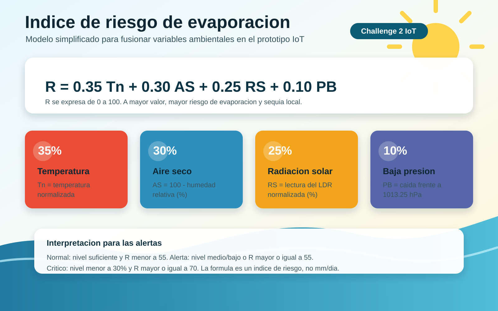

# Formula del indice de riesgo de evaporacion



## Formula usada

```text
R = 0.35 Tn + 0.30 AS + 0.25 RS + 0.10 PB
```

Donde:

- `R`: indice de riesgo de evaporacion entre 0 y 100.
- `Tn`: temperatura normalizada. A mayor temperatura, mayor riesgo.
- `AS`: aire seco, calculado como `100 - humedad relativa (%)`.
- `RS`: radiacion solar aproximada, normalizada desde el sensor LDR.
- `PB`: baja presion atmosferica, calculada como una caida respecto a 1013.25 hPa.

## De donde sale esta formula

Esta formula no es una ecuacion fisica exacta de evaporacion en mm/dia. Es un indice de riesgo simplificado para el prototipo IoT del Challenge 2.

La base sale del enunciado, que pide medir y analizar evaporacion potencial usando variables meteorologicas criticas: radiacion solar, temperatura, humedad y presion atmosferica. Por eso el indice combina esas cuatro senales en un solo valor de 0 a 100.

La asignacion de pesos se definio con criterio de diseno ingenieril:

- La temperatura tiene peso alto porque incrementa la energia disponible para evaporar agua.
- La humedad relativa se transforma en aire seco, porque cuando la humedad baja el aire puede recibir mas vapor de agua.
- La radiacion solar tambien tiene peso alto porque aporta energia directa sobre la lamina de agua.
- La presion atmosferica se incluye con menor peso porque ayuda a caracterizar el estado meteorologico, pero en este prototipo tiene menor influencia que temperatura, humedad y radiacion.

En una version profesional, esta formula deberia calibrarse con datos reales del embalse o reemplazarse por un modelo hidrometeorologico mas completo. Para el prototipo, su funcion es permitir una logica de fusion clara y justificable para activar alertas tempranas.
